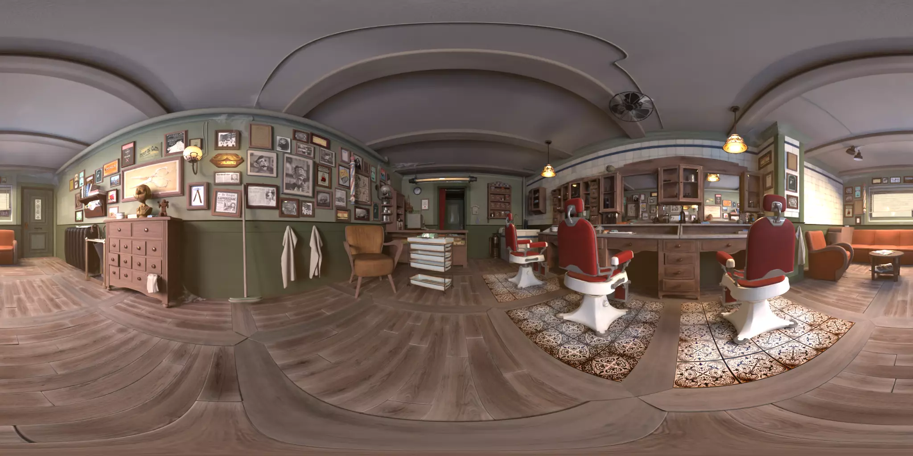
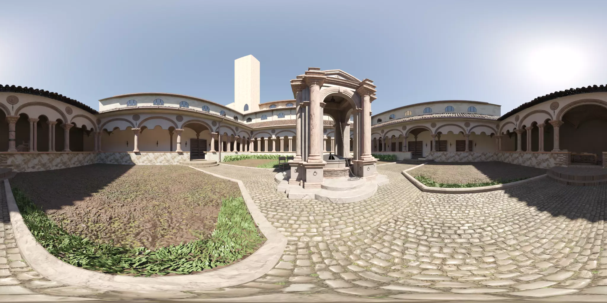

<div class="thumbnails in-body">
<a href="https://arxiv.org/abs/2204.09523">


</a>

# [SILVR: A Synthetic Immersive Large-Volume Plenoptic Dataset](https://idlabmedia.github.io/large-lightfields-dataset)
</div>

[](https://github.com/IDLabMedia/large-lightfields-dataset/stargazers) [](https://paperswithcode.com/dataset/silvr) [](https://cs.paperswithcode.com/paper/silvr-a-synthetic-immersive-large-volume) [](https://arxiv.org/abs/2204.09523) [](#credits)

We present _SILVR_, a dataset of light field images for six-degrees-of-freedom
navigation in large fully-immersive volumes. The _SILVR_ dataset is short for
_"**S**ynthetic **I**mmersive **L**arge-**V**olume **R**ay"_ dataset.

## Properties
Our dataset exhibits the following properties:

 - **synthetic**: Rendered using Blender 3.0 with Cycles, the images are
   perfect and do not need any calibration. Camera positions and lens
   configurations are known exactly and provided in the corresponding JSON
   files.
 - **large interpolation volume**: The camera configurations span a
   relatively large volume (a couple of meters in diameter).
 - **large field of view**: In order to maximize the _interpolation volume_
   (a.k.a: the walkable volume of light), the images are rendered using fisheye
   lenses with a field of view of 180°.
 - **immersive**: Thanks to the large field of view and positioning of the
   viewpoints, every point within the interpolation volume has a full panoramic
   field of view of light information available.
 - **realism**: The selected scenes have reasonable realism.
 - **depth maps**: As the images are computer-generated renders, we provide
   depth maps for every image.
 - **specularities** and **reflections**: The scenes exhibit some specularities
   or reflections, including mirrors. Reflections and mirrors always have the
   depth of the surface, and not the apparent depth of the reflections.
 - **volumetrics**: Some volumetrics are also present (fire, smoke, fog) in the
   `garden` scene.
 - **densly rendered**: The camera setup is rather dense (around 10cm spacing
   between cameras).

## Scenes

We present light field renders with various camera setup configurations for three scenes: _Agent 327: Barbershop_, _Zen Garden_, and _Lone Monk_.

### Agent 327: Barbershop



This scene is taken from [the Blender website, under the "demo files"
section](https://www.blender.org/download/demo-files/#cycles). It is licensed
CC-BY, by [Blender Foundation](https://studio.blender.org).

Download the original _Agent 327: Barbershop_ scene **with light field camera setups** [here (272MB)](https://cloud.ilabt.imec.be/index.php/s/anFWqc5TwW646Ex).
Note that our [Blender Lightfield Addon](https://github.com/IDLabMEDIA/blender-lightfield-addon) is required to open the Blender file with light fields.

### Zen Garden


This scene is made in-house by IDLab-MEDIA. It is licensed [CC-BY 4.0](https://creativecommons.org/licenses/by/4.0/).

Download the _Zen Garden_ scene **with light field camera setups** [here (231MB)](https://cloud.ilabt.imec.be/index.php/s/TTBDMbSziDgFyR7).
Note that our [Blender Lightfield Addon](https://github.com/IDLabMEDIA/blender-lightfield-addon) is required to open the Blender file with light fields.

### Lone Monk



This scene is made by Carlo Bergonzini from [Monorender](http://www.monorender.com/), licensed CC-BY.
The original scene is also available for download from [the Blender website, under the "demo files"
section](https://www.blender.org/download/demo-files/#cycles).
Applied modifications:
 - Added roof geometry above the section with the chair.
 - Solidify modifier on the roof tiles.

Download the modified _Lone Monk_ scene **with light field camera setups** [here (33MB)](https://cloud.ilabt.imec.be/index.php/s/wTwwPyD8pp4CQkp).
Note that our [Blender Lightfield Addon](https://github.com/IDLabMEDIA/blender-lightfield-addon) is required to open the Blender file with light fields.

## Download

All images are provided in OpenEXR format with HDR colors and depth in meters.
Files are available for download from our own [storage service](https://cloud.ilabt.imec.be/index.php/s/KHWopdXmT3Dxo5P).
All files can be downloaded individually. Below you can find an overview of the different files and their sizes.

```
 - Barbershop
   - barbershop_LFCuboid_1mx3mx1m.tar       (16    GB)
   - barbershop_LFSphere_e105cm_d145cm.tar  ( 7.5  GB)
   - barbershop_LFSphere_e110cm_d100cm.tar  (    43MB)
   - barbershop_LFCuboid_8panos.tar         (   172MB)
 - Garden
   - garden_LFCuboid_2x2x1.tar              (25    GB)
   - garden_LFSphere_e100cm_d170cm.tar      ( 8.7  GB)
   - garden_LFSphere_e100cm_d50cm.tar       (    51MB)
   - garden_LFCuboid_8panos.tar             (    86MB)
 - Lone Monk
   - lone_monk_LFCuboid_4mx4mx3m.tar        (24    GB)
   - lone_monk_LFSphere_e220cm_d400cm.tar   ( 6.8  GB)
   - lone_monk_LFSphere_e160cm_d220cm.tar   (   500MB)
   - lone_monk_LFCuboid_8panos.tar          (   159MB)
```

Find the sha256 checksums [here](./sha256sums.txt).
The letters `e` and `d` in the filenames are for 'elevation' and 'diameter'.

## Tools

### Lens Reproject
As the images are rendered using equisolid fish-eye lenses, we also supply a
tool (written in C++) to generate reprojected images with other lens types, as
most established light field research assumes rectilinear lenses.

**Project page:** [github.com/IDLabMEDIA/image-lens-reproject](https://github.com/IDLabMEDIA/image-lens-reproject)  

### NeRF configuration generator
We provide a Python script
[`generate_NERF_transforms.py`](https://github.com/IDLabMEDIA/large-lightfield-dataset/blob/main/generate_NERF_transforms.py)
that produces the required NeRF configuration to test our scenes in NeRF using
[instant-ngp](https://github.com/NVlabs/instant-ngp).

**Script source:** [github.com/IDLabMEDIA/large-lightfield-dataset/generate_NERF_transforms.py](https://github.com/IDLabMEDIA/large-lightfield-dataset/blob/main/generate_NERF_transforms.py)  

Example on the spherical rendering configuration of _barbershop_, _lone monk_
and _garden_, after reprojecting it using the `lens-reproject` tool (as
instant-ngp only support rectilinear images):

&nbps;&nbps;

#### NeRF: How to?
First, we reproject the images (in this example from the scene _lone monk_)
with a rectilinear lens of 18mm focal length on a 36mm sensor, and store them
in PNG format with a resolution 1/8th of the original images (i.e.: 256x256),
while reducing exposure by one stop and applying Reinhard tone mapping with
maximum brightness 5:
```sh
mkdir lone_monk_perspective
./reproject --parallel 4 --rectilinear 18,36 --scale 0.125 \
  --png --exposure -1 --reinhard 5 \
  --input-dir lone_monk/LFSphere_e220cm_d400cm/exr \
  --input-cfg lone_monk/LFSphere_e220cm_d400cm/lightfield.json \
  --output-dir lone_monk_perspective \
  --output-cfg lone_monk_perspective/lightfield.json
```
Now, we generate the `transforms.json` required by instant-ngp:
```sh
python3 generate_NERF_transforms.py \
  --scene lone_monk \
  --dataset-config lone_monk_perspective/lightfield.json \
  --output-transforms lone_monk_perspective/transforms.json
```
Finally, open the dataset with with instant-ngp:
```sh
cd instant-ngp
build/testbed --scene=path/to/lone_monk_perspective/transforms.json
```
Here, make sure to set the _"Near distance"_ under the _Training_ options to 0.
Consider restarting training after you did.

### Blender Lightfield Addon
[The Blender addon](https://github.com/IDLabMEDIA/blender-lightfield-addon) we
developed in-house to produce the dataset images is also open-sourced to enable
anyone to start producing light field datasets from virtual scenes in Blender.

**Project page:** [github.com/IDLabMEDIA/blender-lightfield-addon](https://github.com/IDLabMEDIA/blender-lightfield-addon)  

 


## Credits

To cite this paper:

<!--  -->
```bibtex
@inproceedings{courteaux2022silvr,
 title = {{SILVR: A Synthetic Immersive Large-Volume Plenoptic Dataset}},
 author = {Courteaux, Martijn and Artois, Julie and De Pauw, Stijn and Lambert, Peter and Van Wallendael, Glenn},
 year = {2022},
 doi = {10.1145/3524273.3532890},
 publisher = {Association for Computing Machinery},
 url = {https://doi.org/10.1145/3524273.3532890},
 address = {New York, NY, USA},
 month = {jun},
 numpages = {6},
 isbn = {978-1-4503-9283-9/22/06},
 booktitle = {13th ACM Multimedia Systems Conference (MMSys '22)},
 location = {Athlone, Ireland}
}
```
<!--  -->

Dataset and paper by [IDLab MEDIA](https://media.idlab.ugent.be/).
