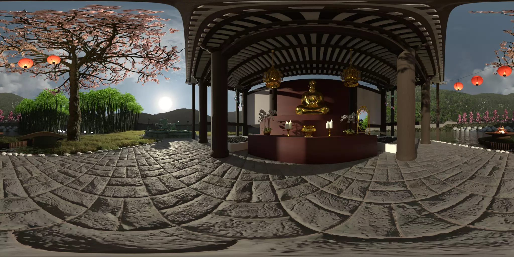
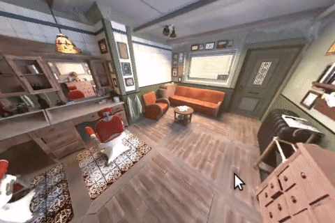
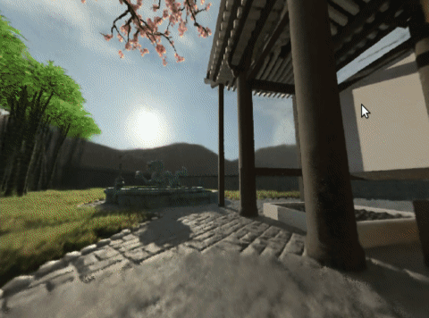

# [Large Lightfields Dataset](https://idlabmedia.github.io/large-lightfield-dataset)

We present a dataset of light field images with the aim for providing a useful
dataset for immersive VR experiences. 

## Properties
Our dataset exhibits the following properties:

 - **synthetic**: Rendered using Blender 3.0 with Cycles, the images are
   perfect and do not need any calibration. Camera positions and lens
   configurations are known exactly and provided in the corresponding JSON
   files.
 - **large interpolation volume**: The used camera configurations span a
   relative large volume (a couple of meters in diameter).
 - **large field of view**: In order to maximize the _interpolation volume_
   (a.k.a: the walkable volume of light), the images are rendered using fisheye
   lenses with a field of view of 180°.
 - **realism**: The selected scenes have reasonable realism.
 - **depth maps**: As the images are computer-genereted renders, we provide
   depth maps for every image.
 - **specularities** and **reflections**: The scenes exhibit some speculars or
   reflections, including mirrors. Reflections and mirrors always have the
   depth of the surface, and not apparent depth of the reflections.
 - **volumetrics**: Some volumetrics are also present (fire, smoke, fog) in the
   `garden` scene.
 - **densly rendered**: The camera setup is rather dense (around 10cm spacing
   between cameras).

## Scenes

We present two scenes: _barbershop_ and _garden_.

### Barbershop

This scene is taken from [the Blender website, under the "demo files"
section](https://www.blender.org/download/demo-files/#cycles). It is licensed
CC-BY.

### Garden

This scene is made in-house by IDLab-MEDIA. It is licensed [CC-BY
4.0](https://creativecommons.org/licenses/by/4.0/).

## Tools

### [Lens Reproject](https://github.com/IDLabMEDIA/image-lens-reproject)
As the images are rendered using equisolid fish-eye lenses, we also supply a
tool (written in C++) to generate reprojected images with other lens types, as
most established light field research uses rectilinear lenses.

### [NeRF configuration generator](https://github.com/IDLabMEDIA/large-lightfield-dataset/blob/main/generate_NERF_transforms.py)
We provide a Python script that produces the required NeRF configuration to
test our scenes in NeRF using [instant-ngp](https://github.com/NVlabs/instant-ngp).

Example on the spherical rendering configuration of barbershop and garden,
after reprojecting it using the `lens-reproject` tool (as instant-ngp only
support rectilinear images):

### [Blender Lightfield Addon](https://github.com/IDLabMEDIA/blender-lightfield-addon)
The Blender addon we developed in-house to produce the dataset images is also made available publicly.

 

